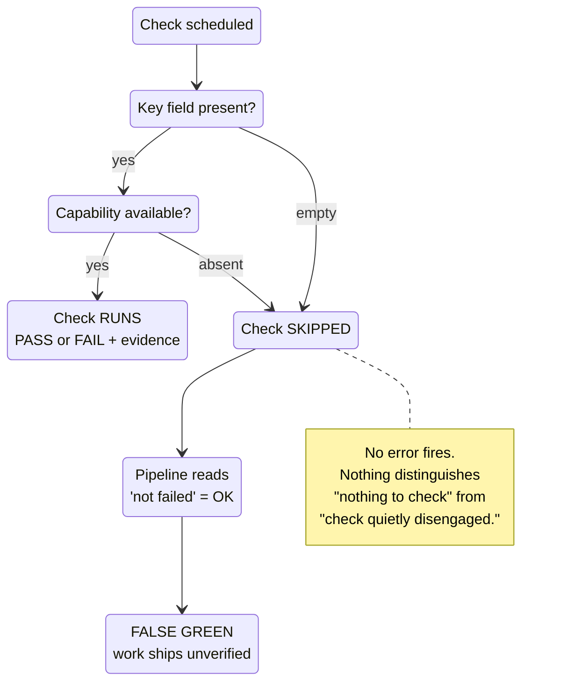
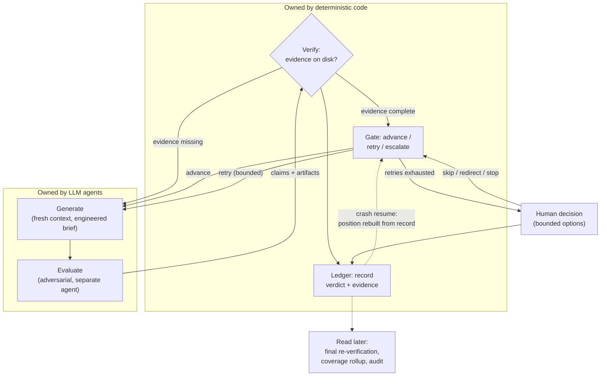
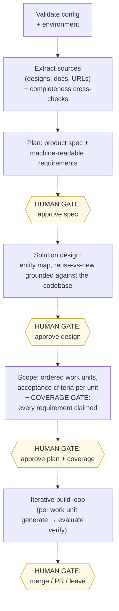

# Engineering Reliability into AI Agent Code Generation

## Part I — The Problems, the Patterns, and the Architecture

A three-part article for engineering leaders and architects deciding how to adopt AI agents for real software delivery. Part I defines the failure modes and the high-level architecture that answers them. Part II descends into each architectural component. Part III extends the architecture to the team-of-agents layer, walks through a production post-mortem, and closes with what remains unsolved.

**What you'll learn in Part I:**

- Why single-agent code generation fails late, not early — the eight failure modes behind that shape (P1–P8), each backed by published research
- Why a green dashboard can be the most dangerous artifact in an agent pipeline: false-success rates up to 75.8%, checks that silently skip, inputs that are silently partial
- Why adding more prompt rules stops working — instruction adherence collapses toward zero as rules stack — and what replaces prompt rules
- The one architectural boundary that matters: models generate and evaluate; deterministic code decides
- Where human judgment is cheapest: gates before code exists, not after — HITL after code is review theater
- Three mechanisms the agentic-patterns catalog is missing: a deterministic control boundary, an evidence model, and earned capabilities

---

Ask a capable AI agent to "build this feature" and, most days, something impressive happens. Code appears. Tests appear. A confident summary appears, reporting success. For a demo, that is the end of the story. For a production system, it is the beginning of a different one — because the confidence is not evidence, and on long tasks the gap between the two grows in exactly the places you are least likely to look.

This article is a field report. It comes out of building and operating a multi-agent code-generation pipeline through real product deliveries — and out of one delivery in particular, where the pipeline reported **seven of seven work units passed, every requirement covered**, while the shipped UI looked dramatically different from the approved design. Every dashboard was green. The work was wrong.

The thesis, up front: **reliability in agent systems does not come from better prompts. It comes from treating agent output as untrusted input to an engineering system** — deterministic control flow, evidence-backed verification, and human judgment placed where it is cheap. In our experience, every time a rule moved from prompt text into code, reliability went up. And every check that could silently skip eventually did.

One scope note before the argument. The pipeline runs as a Claude Code plugin: the orchestrating model comes with the harness — a given, not a design choice. That constraint shaped the most distinctive mechanisms here, because when you cannot replace the conductor, enforcement gets built around it: deterministic validators, hooks, and printed schedules — decision tables shipped as small programs, whose printed output the model follows instead of re-deriving the logic from prose. Teams that own their control loop natively — workflow-engine architectures — inherit part of this discipline for free; the evidence and verification layer they still need. The patterns are argued stack-agnostically; they were proven in one harness.

---

## 1. The problem we wanted to solve

Single-agent code generation fails in a characteristic shape: not early, but late. The first hour is excellent; the tenth is not. Understanding why requires naming the individual failure modes precisely, because each one demands a different countermeasure. We catalogued eight. None of them is hypothetical — each burned us at least once, and each is now independently documented in the research literature.

### P1 — Context rot

An agent working in one long-lived conversation accumulates everything: stale file contents, dead ends, resolved errors, its own verbose narration. Model quality degrades as that window fills. The "lost in the middle" line of research showed multi-document QA accuracy dropping by more than 20% when relevant information sits mid-context — the severity varies by task and model (the Claude-1.3 variants were noticeably flatter), but the U-shaped curve appeared in most models tested ([Liu et al.](https://arxiv.org/abs/2307.03172)). Chroma's evaluation of 18 models found performance "grows increasingly unreliable as input length grows" even on simple tasks — the report that made context rot the standard name for the phenomenon ([Chroma](https://www.trychroma.com/research/context-rot)). Are findings from 2023 and mid-2025 still relevant? The naive version — the U-shaped positional curve — has visibly improved with each model generation, and each generation's measurements age with it (Liu et al. measured the GPT-3.5/Claude-1.3 generation; Chroma's evaluation spans the GPT-4.1/Claude-4/Gemini-2.5 era). The pattern worth trusting is that the degradation keeps being re-measured at whatever the frontier currently is: as of May 2026, Claude Opus 4.6, GPT-5.4 Thinking and Gemini 3.1 Pro used as long-transcript classifiers miss dangerous actions 2×–30× more often when those actions sit after 800K tokens of benign context — Opus 4.6 with extended thinking, on the needle-injection task, drops from 99.7% recall at 100K tokens to 69% at 800K ([Martin & Roger](https://arxiv.org/abs/2605.12366)). The problem moves with the frontier; it does not disappear — and an architecture that bets on the next generation closing it is betting against three years of converging evidence from three research groups measuring three different faces of the same degradation. The practical consequence for agents: the decisions made in hour ten — which are usually the integration decisions, the ones that hurt most when wrong — are made against the noisiest context of the entire run.

### P2 — Self-assessed success

Agents grade their own homework, and they grade generously. A 2026 study of nearly twelve thousand agent trajectories found false success — the agent claiming completion when the task failed — in 45–48% of failing runs in single-control τ²-bench domains (though only 3% in the dual-control telecom domain), and — on AppWorld, a separate benchmark in the same study — **75.8% of failing runs for coding agents that explicitly self-assess their status** ([Advani](https://arxiv.org/abs/2606.09863)). Calibration work found the same shape: some agents that succeed only 22% of the time predict 77% success ([Kaddour et al.](https://arxiv.org/abs/2602.06948)). Anthropic's harness-design post put it plainly: asked to evaluate their own work, agents "tend to respond by confidently praising the work — even when, to a human observer, the quality is obviously mediocre" ([Anthropic, harness design](https://www.anthropic.com/engineering/harness-design-long-running-apps)). A status report from an agent is a claim, not a fact.

### P3 — Prompt-rule decay

The intuitive fix for agent misbehavior is another instruction. It does not scale. Benchmark work on stacked instructions shows the rate at which a model satisfies every rule in its prompt hitting an effective floor of zero by around 80 concurrent rules — across all five models, four formats, and both placements tested, with the steep decline starting near 40 — a redesign point rather than a tuning point ([Eliav](https://arxiv.org/abs/2607.19257)) — and a second benchmark finds instruction-follow rates falling from ~96% to as low as 20% as constraints accumulate ([Anand & Chattaraj](https://arxiv.org/abs/2608.02639)). Both test mechanical, programmatically checkable rules; the authors are explicit that the exact thresholds are properties of the models tested, not laws. Worse, prompt rules fail silently: when an instruction erodes under context pressure, no error fires. A rule that matters cannot live only in the prompt.

### P4 — Silent gate disengagement

The most dangerous entry in this catalog, and the proximate cause of our false-green delivery. A verification step keyed on a field that can be empty, or a capability that can be absent, does not fail — it records "skipped." And a pipeline that treats skipped as acceptable reads it as success. The output looks audited. Software operations has known this failure class for decades — Google's SRE canon prefers alerting on user-visible symptoms over internal causes, because a page should fire only when users are actually affected, and internal indicators alone do not tell you that ([Google SRE Book](https://sre.google/sre-book/monitoring-distributed-systems/)) — and the data-engineering world rediscovered it in pipeline form: every job completes, the orchestrator shows green, no exception is raised, no alert fires — while the data is quietly incomplete or wrong ([SeattleDataGuy](https://seattledataguy.substack.com/p/the-5-silent-failures-in-data-pipelines)). Agent pipelines inherit this failure class and add a new twist: the checks themselves are often conditionally constructed by the pipeline, so a wiring gap manufactures skips at scale.

C1 — Anatomy of a false green: two ordinary conditions (an empty field, an absent capability) compose into an unverified ship with no alarm anywhere. (Figures are numbered C1–C11 across the article's three parts.)

### P5 — Requirements coverage by eyeball

Ask "does the implementation cover every requirement?" of a human process and you get reviews, matrices, sign-offs. Ask it of an agent pipeline and, by default, you get nothing: generated code carries no link to the requirement that motivated it. Researchers on AI-code provenance argue that provenance information — tracing generated code back to the prompt components, training data, and model internals that produced it — is "a practical necessity that current tools do not provide" ([Velasco et al.](https://arxiv.org/abs/2608.02329), a research-vision paper), and the gap has measurable consequences: Apiiro's analysis of repositories and developers affiliated with Fortune 50 enterprises (vendor research, Sept 2025) found that developers using AI assistants shipped **322% more privilege-escalation paths and 153% more architectural design flaws** than their unassisted peers — while syntax errors fell 76% and logic bugs 60%, which is the sharper point: AI improves local correctness while degrading exactly the cross-cutting properties — security posture, architectural constraints — that line-by-line review does not surface ([Apiiro](https://apiiro.com/blog/4x-velocity-10x-vulnerabilities-ai-coding-assistants-are-shipping-more-risks/)). Coverage tracked by human attention does not survive contact with agent throughput.

### P6 — Silently partial inputs

Agent pipelines consume artifacts that arrive by hand: design exports, requirement documents, data files. Manual delivery has no transport error. A partial export parses cleanly and yields a plausible result missing a third of its content — the input-side twin of P4. Data engineering calls the general phenomenon data downtime — periods when data is "partial, erroneous, missing or otherwise inaccurate" ([Monte Carlo](https://montecarlo.ai/blog-the-rise-of-data-downtime)) — and its case literature has the same shape: a manual Excel upload path whose records an incremental pipeline silently skipped, batch after batch, with no exception and every run reporting success ([phData](https://www.phdata.io/blog/preventing-silent-data-loss/)). In our false-green delivery, the design reference the agents implemented against had silently lost most of its views at ingestion — only 7 of 30 survived. Nothing said so. That partial input was the origin of our false green; P4 — the gates that silently disengaged — is why nothing downstream caught it.

### P7 — Non-deterministic orchestration

If an LLM writes the code and decides which steps to take, both layers inherit the model's variance. Anthropic's influential taxonomy draws the line between **workflows** — LLMs orchestrated through predefined code paths — and **agents**, which direct their own process, and advises workflows for well-defined tasks, reserving agents for when flexibility and model-driven decision-making are needed at scale ([Anthropic, Building Effective Agents](https://www.anthropic.com/engineering/building-effective-agents)). The variance is not subtle: on the TravelPlanner benchmark, moving operational logic from agent discretion into deterministic blueprints cut commonsense-constraint violations by 96% against the same model on an agentic baseline — 11 versus 275 ([Qiu et al.](https://arxiv.org/abs/2508.02721)). Left free, an orchestrating LLM under context pressure will quietly optimize away the very steps that exist to catch its mistakes — we watched it happen.

### P8 — Rigor versus cost

Every countermeasure above costs tokens and wall-clock. Anthropic reports agents consuming ~4× the tokens of chat, and multi-agent systems ~15× ([Anthropic, multi-agent research](https://www.anthropic.com/engineering/multi-agent-research-system)); their own three-agent harness experiment cost **\$200 and six hours versus \$9 and twenty minutes** for a solo run of the same task ([Anthropic, harness design](https://www.anthropic.com/engineering/harness-design-long-running-apps)). The punchline, though, is in the outcomes: the solo run's core feature did not work. Rigor is expensive; unverified failure is more expensive; and a system with no cheap path will be bypassed by its own users. The architecture must let you buy exactly as much rigor as the task warrants.

---

These eight compound. Context rot (P1) accelerates prompt-rule decay (P3); decayed rules stop the orchestrator from running checks (P7); the skipped checks read as green (P4); the self-assessment layer confidently confirms it (P2). That cascade is not a tail risk — on long tasks it is the default trajectory. It would still be a manageable one if agent runs stayed short; they are not staying short, and that is the one external fact this argument depends on. METR's longitudinal measurements have the length of task a frontier model completes at 50% reliability doubling roughly every seven months since 2019 — closer to every three in the post-2024 data — with the frontier measurement — Claude Mythos Preview, May 2026 — at sixteen hours, two working days, which is also the ceiling past which METR's current task suite cannot measure reliably ([METR, 2025](https://metr.org/blog/2025-03-19-measuring-ai-ability-to-complete-long-tasks/); [METR, Time Horizon 1.1](https://metr.org/blog/2026-1-29-time-horizon-1-1/); [METR, live tracker](https://metr.org/time-horizons/)). Every doubling extends the part of the run where these failure modes concentrate; an architecture that is only safe on short tasks is aging out on that curve.

---

## 2. A pattern vocabulary

Before architecture, vocabulary. The agent-engineering community has converged on a reasonably stable catalog of design patterns — Antonio Gullí's Agentic Design Patterns is the most complete treatment, cataloguing twenty-one, and Anthropic's workflow taxonomy covers the orchestration subset. Leaders evaluating an agent architecture should be able to ask "which patterns does this compose, and what did you add?" the same way they would ask about GoF patterns in an OO design.

The reference architecture in this article composes fourteen of the twenty-one catalog patterns (the remainder — tool use, inter-agent communication, learning and adaptation, and the like — are either assumed or deliberately excluded, as Part III explains for inter-agent communication):

| Catalog pattern                     | Where it appears in this architecture                                                                                                                                     |
|-------------------------------------|---------------------------------------------------------------------------------------------------------------------------------------------------------------------------|
| **Prompt Chaining**                 | The pipeline itself: plan → design → scope → implement → evaluate, each phase consuming the previous phase's artifact                                                     |
| **Planning**                        | Dedicated planning and solution-design phases producing reviewable artifacts before code exists                                                                           |
| **Routing**                         | Model strength routed per work unit by declared complexity; strongest models only where judgment compounds                                                                |
| **Parallelization**                 | Independent work units dispatched concurrently — but only when independence is proven, not assumed; the schedule itself is printed by code, never re-derived by the model |
| **Reflection**                      | Evaluator feedback driving bounded regeneration — with the crucial amendment below                                                                                        |
| **Multi-Agent Collaboration**       | Specialist roles (planner, architect, scoper, implementer, evaluator, summarizer) instead of one generalist                                                               |
| **Memory Management**               | Tiered knowledge with engineered briefs; inter-phase compression as a deliberate artifact                                                                                 |
| **Knowledge Retrieval (RAG)**       | On-demand knowledge queries available to every role, with per-role budgets                                                                                                |
| **Goal Setting and Monitoring**     | Machine-readable requirements claimed by work units; coverage computed, not eyeballed                                                                                     |
| **Exception Handling and Recovery** | Escalation as a first-class state: bounded retries, then a structured human decision                                                                                      |
| **Human-in-the-Loop**               | Approval gates at the spec, design, and plan — where change is cheap                                                                                                      |
| **Resource-Aware Optimization**     | A lightweight single-iteration path for small tasks; full pipeline for feature-sized ones                                                                                 |
| **Guardrails/Safety Patterns**      | Deterministic validators on every phase transition                                                                                                                        |
| **Evaluation and Monitoring**       | Evaluation as a separate adversarial role, required to attach evidence                                                                                                    |

Two amendments to the catalog matter enormously in practice:

**Reflection must be adversarial, not introspective.** The catalog's Reflection pattern — the model critiques and improves its own output — runs straight into P2. Self-critique is the least reliable form of evaluation: the false-success studies above measured it, and Anthropic's harness work reached the same conclusion, splitting generation and evaluation into separate, GAN-inspired agents after finding that tuning a standalone evaluator to be skeptical is far more tractable than making a generator critical of its own work. Reflection works when the reflector is a different context with different incentives and — critically — access to evidence rather than to the generator's narrative.

**The catalog has no discipline layer.** Nothing in the twenty-one patterns says how the pipeline knows a pattern actually executed. That gap is precisely where P2, P3, P4, and P7 live. The architecture below adds three mechanisms that we believe belong in the catalog as first-class patterns. The **deterministic control boundary**: workflow control lives in code — models act inside states, and no model, however convinced it is that a step is redundant, can move the pipeline between them. The **evidence model**: no claim moves the pipeline without an on-disk artifact a deterministic verifier can inspect, and small structured outputs are schema-validated at the boundary before they are ever allowed to become files. And **earned capabilities**: a capability flag — this source can produce reference renders, this check can run — is true only when the artifacts backing it actually exist, earned from what was delivered rather than declared from hope; a check that cannot run records SKIPPED, never PASS, and where a reference exists, SKIPPED itself is a violation. Part II treats each in detail, and its appendix writes all three in catalog form — name, intent, problem, forces, mechanism, consequences — so they can be evaluated, and argued with, as patterns.

---

## 3. The architecture, high level

### 3.1 The control loop

Everything in the architecture is an elaboration of one loop, and one boundary drawn through it:

C2 — The control loop. Models generate and evaluate; code decides. No agent — including the orchestrating one — can move the pipeline forward. Only the verifier can, and it accepts evidence, not claims.

The boundary is the load-bearing decision. Everything an LLM produces — code, test results, evaluations, status reports — is treated as a claim. Claims cross into the code-owned region only accompanied by artifacts a deterministic verifier can inspect: logs with exit codes, screenshots with encoded parameters, per-criterion evidence strings. The orchestrator that dispatches agents is itself an LLM, and it is also untrusted: phase transitions happen through a code-validated step — the gate in C2, which advances, retries, or escalates on the verifier's verdict — or not at all, which is the direct answer to P7. When the verifier finds a violation, the result is not a warning — it is a blocked transition with a structured description of what is missing, injected into the next dispatch.

This does not make the orchestrator decision-free. It still chooses what feedback to inject into a re-dispatch, whether a retry remains, which claims to spot-check, whether a handoff warrants an interpretive pass. But every decision it makes is reversible inside the retry budget — the worst case is one wasted dispatch. The irreversible decisions — waive a criterion, degrade a check, skip a unit, stop the run — are never the orchestrator's; they belong to a human, and they land in the ledger as waivers.

The third code-owned component in C2, the ledger, is easy to overlook because it makes no decisions. It is the append-only record of what happened: every verdict with its evidence, every human choice with its rationale. Its consumers come later — a crashed run resumes from the ledger rather than from any model's memory, the end-of-run hook re-verifies completed work against it, and the final coverage report is computed from it. In a system where every model output is a claim, the ledger is the one component allowed to be trusted without verification, because nothing is asked of it except to remember.

This is Anthropic's workflows-over-agents recommendation taken to its conclusion: the workflow is not merely predefined, it is enforced, because a predefined path that the orchestrating model can skip under context pressure is a suggestion, not a workflow.

### 3.2 The pipeline

The loop runs inside a phase pipeline whose shape answers a different question: where is human judgment cheapest?

C3 — The phase pipeline. Human gates (highlighted) sit before code exists — at the spec, the design, and the plan — where a correction costs minutes. The only post-code gate is the final disposition.

Three properties of this shape deserve a leader's attention:

**Judgment is front-loaded.** Reviewing a spec, a solution design, and a work breakdown takes a human minutes each, and a correction at any of these gates costs almost nothing — the artifact is text. Reviewing a finished thousand-line diff is slower, less reliable, and corrections cost a rebuild. The gates are placed where the ratio of insight-per-minute to cost-of-change is best. This is the Human-in-the-Loop pattern, but positioned: HITL after code is review theater; HITL before code is control.

**Every phase emits an artifact, and the next phase consumes only artifacts.** The spec, the requirements list, the solution design, the work-unit contracts — each is a file with a defined shape, validated on write. Agents never hand each other conversation; they hand each other documents. This is what makes fresh-context dispatch (the answer to P1) possible, and it is what makes the pipeline resumable after a crash: state lives on disk, not in anyone's context window.

**Coverage is computed at the gate.** The planning phase emits requirements with stable identifiers; every work unit must claim the identifiers it implements; a deterministic gate fails the breakdown if any requirement is unclaimed — before the human sees it. The human approves a coverage table, not a vibe (P5's answer, detailed in Part II).

### 3.3 The roles

Inside the build loop, work is divided among specialist roles — the Multi-Agent Collaboration pattern, but motivated by context hygiene as much as by skill separation. Each dispatch starts a fresh context containing an engineered brief: the work-unit contract, the relevant slice of the solution design, the relevant knowledge — and nothing else. Between iterations, a handoff artifact carries what the next unit needs to know — and here the code-over-model rule earned its keep a second time: most of that handoff turned out to be derivable (what completed, which files to carry forward, which criteria were skipped), so a script now computes it from the ledger, and a summarizing model pass runs only when the unit's outcome actually warrants interpretation. The long-lived orchestrator never accumulates content at all, only paths and states.

| Role | Mandate | Why it is separate |
|---|---|---|
| Planner | Expand intent into spec + requirements | Product thinking pollutes implementation contexts |
| Solution architect | Map the spec onto the existing codebase | Reuse-vs-new decisions need whole-system view, once |
| Scoper | Break design into contracted work units | The contract is the interface to implementation |
| Implementer | One work unit, fresh context | P1: the tenth unit deserves as clean a window as the first |
| Evaluator | Adversarial verification with evidence | P2: never the implementer; graded on finding problems |
| Summarizer | Add interpretation to a computed handoff | The derivable facts are scripted from the ledger; a model dispatch is bought only when deviation signals warrant judgment |

The evaluator deserves the last word of Part I, because it is where most of the reliability actually comes from. It runs a fail-fast ladder — build, lint, tests, security scan, design fidelity, browser-level behavior, then the unit's acceptance criteria — and it is required to attach evidence to every verdict it emits. Not because the evaluator model is special: because the verifier behind it refuses any PASS that arrives without artifacts. The evaluator can be lazy, sycophantic, or wrong; the claims it makes still do not move the pipeline unless the evidence exists on disk.

That verifier — the evidence model and the earned-capability rule — is where Part II begins; the post-mortem of the delivery where their absence cost us closes the series in Part III.

---

Continue to Part II: the components in detail — deterministic guards, the evidence model, context engineering, adversarial evaluation, the connector contract, traceability, and escalation — with the three proposed patterns in catalog form. Part III completes the series: the team-of-agents layer (coordination that is never requested), the false-green case study, what is still unsolved, and an adoption ladder.

## References (Part I)

1. Liu, N. F., Lin, K., Hewitt, J., Paranjape, A., Bevilacqua, M., Petroni, F., & Liang, P., Lost in the Middle: How Language Models Use Long Contexts (v3, Nov 2023) — [arxiv.org/abs/2307.03172](https://arxiv.org/abs/2307.03172)
2. Hong, K., Troynikov, A., & Huber, J. (Chroma), Context Rot: How Increasing Input Tokens Impacts LLM Performance (14 Jul 2025) — [trychroma.com/research/context-rot](https://trychroma.com/research/context-rot)
3. Advani, L., From Confident Closing to Silent Failure: Characterizing False Success in LLM Agents (1 Jun 2026) — [arxiv.org/abs/2606.09863](https://arxiv.org/abs/2606.09863)
4. Kaddour, J., Patel, S., Dovonon, G., Richter, L., Minervini, P., & Kusner, M. J., Agentic Uncertainty Reveals Agentic Overconfidence (6 Feb 2026) — [arxiv.org/abs/2602.06948](https://arxiv.org/abs/2602.06948)
5. Rajasekaran, P. (Anthropic), Harness design for long-running application development (24 Mar 2026) — [anthropic.com/engineering/harness-design-long-running-apps](https://anthropic.com/engineering/harness-design-long-running-apps)
6. Eliav, N., Prompt Design at Scale: How Format, Instruction Count, and Context Length Shape Instruction Adherence and Hallucination in Large Language Models (21 Jul 2026; released with the VeyraBench harness) — [arxiv.org/abs/2607.19257](https://arxiv.org/abs/2607.19257)
7. Anand, A., & Chattaraj, S., Instruction Stacking Collapse: A Benchmark and the Capability-Dependent Value of Prompt Compilation (31 Jul 2026) — [arxiv.org/abs/2608.02639](https://arxiv.org/abs/2608.02639)
8. Ewaschuk, R. (ed. Beyer, B.), Monitoring Distributed Systems, ch. 6 of Site Reliability Engineering: How Google Runs Production Systems (O'Reilly, 2016) — [sre.google/sre-book/monitoring-distributed-systems](https://sre.google/sre-book/monitoring-distributed-systems)
9. SeattleDataGuy, The 5 Silent Failures in Data Pipelines (24 Apr 2026) — [seattledataguy.substack.com/p/the-5-silent-failures-in-data-pipelines](https://seattledataguy.substack.com/p/the-5-silent-failures-in-data-pipelines)
10. Velasco, A., Wintersgill, N., Stalnaker, T., Chaparro, O., & Poshyvanyk, D., On Automated and Explainable Provenance of AI-Generated Code (3 Aug 2026) — [arxiv.org/abs/2608.02329](https://arxiv.org/abs/2608.02329)
11. Nussbaum, I. (Apiiro), 4x Velocity, 10x Vulnerabilities: AI Coding Assistants Are Shipping More Risks (4 Sept 2025) — [apiiro.com/blog/4x-velocity-10x-vulnerabilities-ai-coding-assistants-are-shipping-more-risks](https://apiiro.com/blog/4x-velocity-10x-vulnerabilities-ai-coding-assistants-are-shipping-more-risks)
12. Moses, B. (Monte Carlo), What is Data Downtime? (4 Feb 2024; originally published as The Rise of Data Downtime) — [montecarlo.ai/blog-the-rise-of-data-downtime](https://montecarlo.ai/blog-the-rise-of-data-downtime)
13. Chen, E. (phData), Trials and Tribulations Preventing Silent Data Loss (15 Oct 2020) — [phdata.io/blog/preventing-silent-data-loss](https://phdata.io/blog/preventing-silent-data-loss)
14. Schluntz, E., & Zhang, B. (Anthropic), Building effective agents (19 Dec 2024) — [anthropic.com/engineering/building-effective-agents](https://anthropic.com/engineering/building-effective-agents)
15. Qiu, L., Ye, Y., Gao, Z., Zou, X., Chen, J., Gui, Z., Huang, W., Xue, X., Qiu, W., & Zhao, K., Blueprint First, Model Second: A Framework for Deterministic LLM Workflow (v2, 16 Jun 2026; the TravelPlanner result) — [arxiv.org/abs/2508.02721](https://arxiv.org/abs/2508.02721)
16. Hadfield, J., Zhang, B., Lien, K., Scholz, F., Fox, J., & Ford, D. (Anthropic), How we built our multi-agent research system (13 Jun 2025) — [anthropic.com/engineering/multi-agent-research-system](https://anthropic.com/engineering/multi-agent-research-system)
17. METR, Measuring AI Ability to Complete Long Software Tasks (19 Mar 2025) — [metr.org/blog/2025-03-19-measuring-ai-ability-to-complete-long-tasks](https://metr.org/blog/2025-03-19-measuring-ai-ability-to-complete-long-tasks)
18. METR, Time Horizon 1.1 (29 Jan 2026) — [metr.org/blog/2026-1-29-time-horizon-1-1](https://metr.org/blog/2026-1-29-time-horizon-1-1)
19. METR, Task-Completion Time Horizons of Frontier AI Models (live tracker; last updated 8 May 2026, accessed 22 Aug 2026) — [metr.org/time-horizons](https://metr.org/time-horizons)
20. Gullí, A., Agentic Design Patterns: A Hands-On Guide to Building Intelligent Systems (Springer Cham, 2025) — [doi.org/10.1007/978-3-032-01402-3](https://doi.org/10.1007/978-3-032-01402-3)
21. Martin, S., & Roger, F. (Anthropic), Classifier Context Rot: Monitor Performance Degrades with Context Length (12 May 2026) — [arxiv.org/abs/2605.12366](https://arxiv.org/abs/2605.12366)