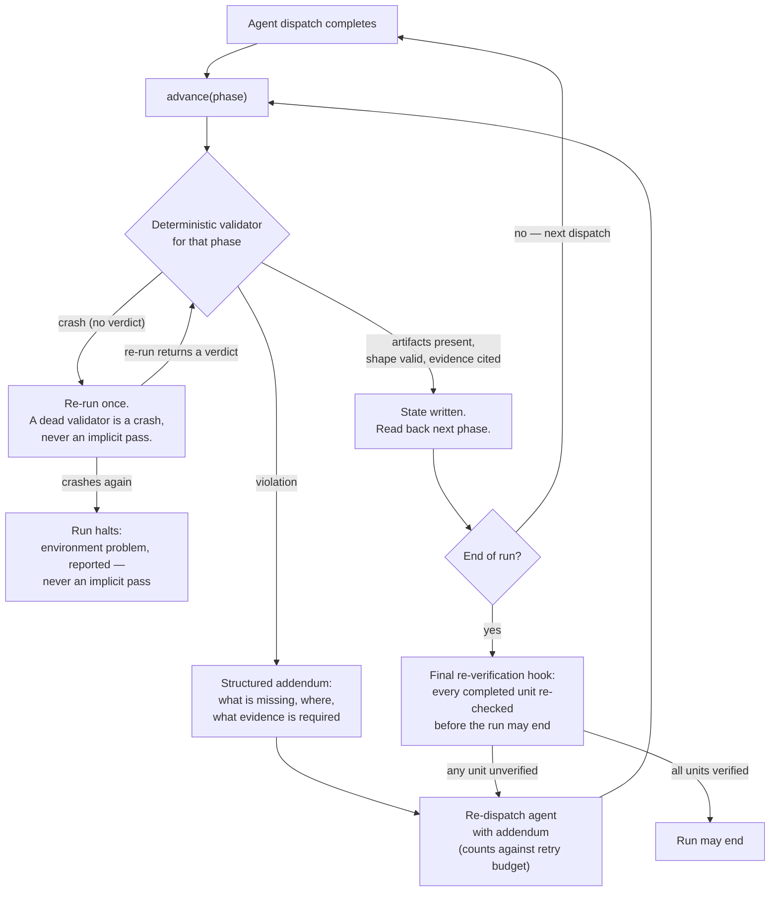
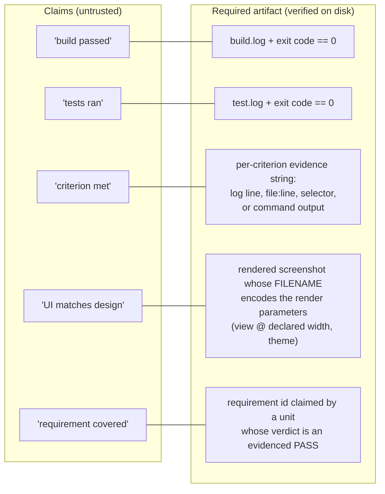
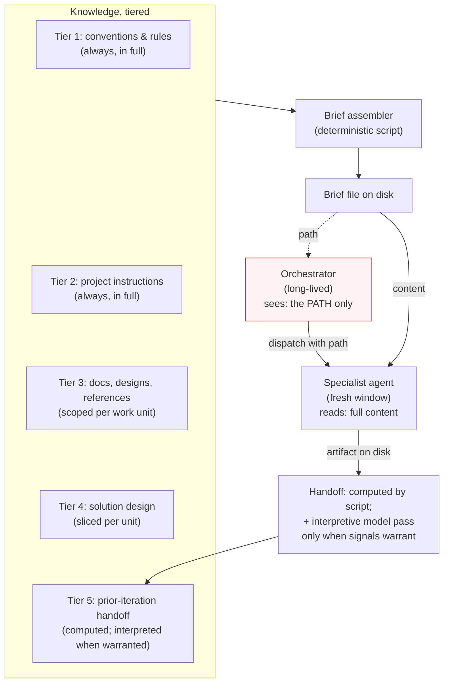
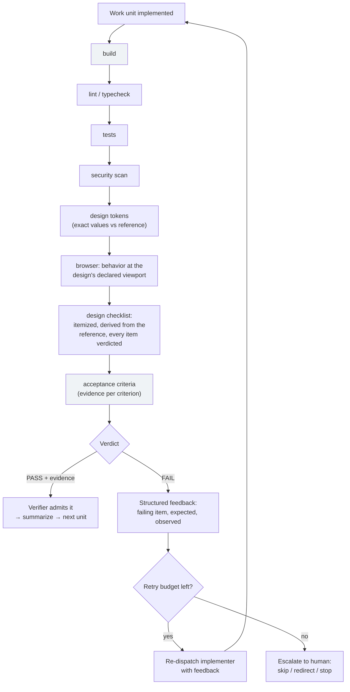
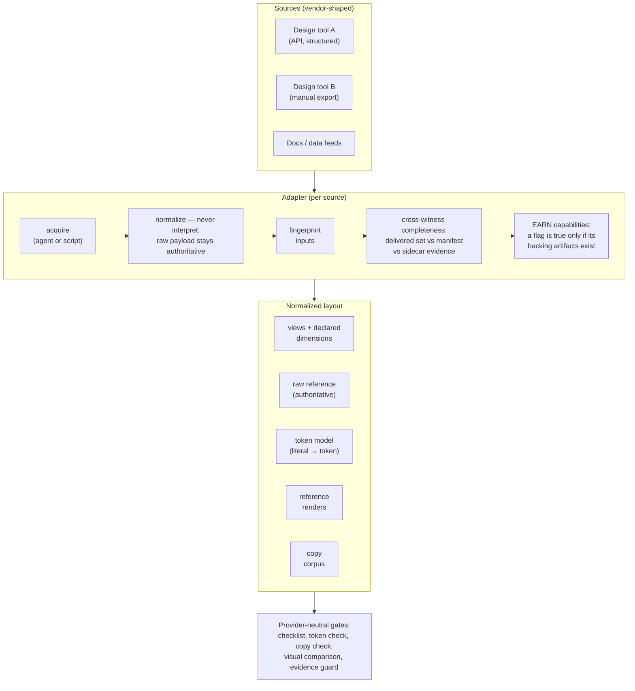
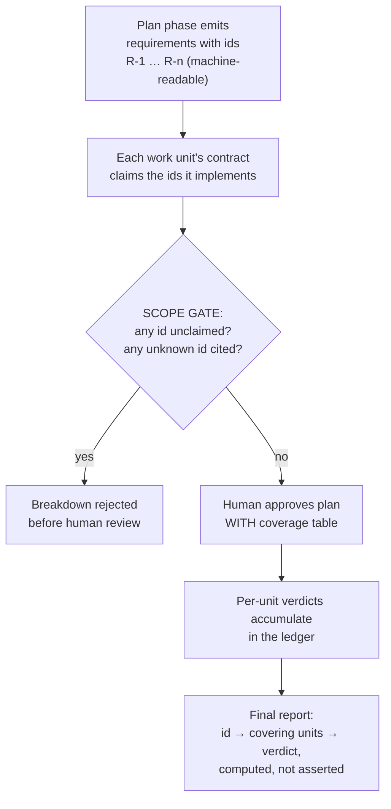
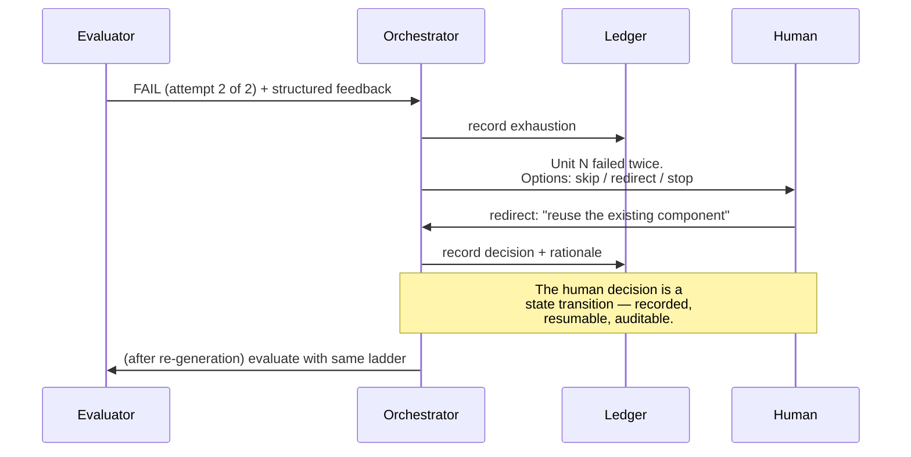

# Engineering Reliability into AI Agent Code Generation

## Part II — The Components

Part I defined eight failure modes of agent code generation (P1–P8), mapped the architecture onto the agentic-patterns catalog, and drew the one boundary that matters: models generate and evaluate; deterministic code decides. Part II opens each component of that architecture in detail and closes with the three proposed patterns written in catalog form. Part III extends the architecture to the team-of-agents layer, walks through the production post-mortem, and maps the frontier.

**What you'll learn in Part II:**

- How to build a state machine an LLM orchestrator cannot talk its way out of: guarded exits, explicit crash semantics, enforcement that reports on itself
- The evidence model: an artifact taxonomy that refuses every claim without proof — and why evidence design is adversarial (agents edit tests to pass them; your checks need their own test suites)
- Context engineering without accumulation: briefs assembled by scripts under hard budgets; an orchestrator that sees only paths and states
- The adversarial evaluation ladder: fail-fast mechanical checks, itemized design checklists instead of vibes, bounded retries with structured escalation
- The connector contract that closes the false-green class: normalize at the boundary, earn capability flags, cross-witness completeness — SKIPPED is never PASS
- Traceability as a computed property, and buying rigor by the unit: routing by stakes, an honest cheap path, escalation as a first-class state

---

## 1. Deterministic guards: the state machine the orchestrator cannot talk its way out of

The orchestrator of an agent pipeline is itself an LLM, which means the pipeline's own conductor exhibits P2, P3, and P7. Early on we watched a characteristic decay: the four-step per-unit pattern — generate, evaluate, verify, summarize — executed perfectly for the first work unit, then eroded. By unit four the orchestrator was "reasoning" that evaluation was redundant for a small change, or that it could inspect the diff itself instead of dispatching the evaluator. Each skipped step was locally plausible. The sum was an unverified build.

The countermeasure is structural: **phase transitions are not the orchestrator's to make.** Advancing the pipeline happens through one deterministic entry point that runs a validator for the phase just completed. The validator checks facts on disk — did the expected artifact appear, is it shaped correctly, does the evidence exist — and only on success writes the new state. On violation, it emits a structured description of what is missing, which is injected verbatim into the re-dispatch of the responsible agent.

C4 — Transition discipline: the pipeline advances through one code-owned entry point, or not at all — and "declare it done and stop" is not an available move.

Four design details generalize beyond this pipeline. First, **the exit path is guarded too**: a hook re-verifies every completed unit before the orchestrator may end its turn, catching the failure mode where work is marked complete in the final summary rather than through the pipeline. Because that hook fires on every turn-end for the life of a session, it memoizes its ALLOW verdict on a stat-only fingerprint of every input the verifier reads — and never caches a BLOCK. The asymmetry is the design: a spurious cache miss costs one re-verification; a spurious hit would cost enforcement, so when in doubt the fingerprint covers more inputs. The effect is measurable: on synthetic builds (fifty consecutive turn-ends, transcript growing throughout), per-turn hook cost before memoization grew with build size — roughly doubling from a 5-unit to a 20-unit build — and after it sits flat at ~66 ms regardless, with the memo holding across all fifty turns. Rigor whose cost grows with the work it protects gets disabled by its own bill eventually; flat-cost rigor survives.

Second, **crash semantics are explicit**: a validator that dies by signal has not returned a verdict — the rule is one re-run, and a second death halts the run as a reported environment problem — because treating non-zero-but-dead as either pass or fail corrupts state. Distinguishing "the check failed" from "the check didn't happen" sounds pedantic until the day it isn't.

Third, **enforcement reports on itself**: a guard that degrades open, or is disabled by configuration, writes that fact — a fingerprint of which guards ran and how, plus every degrade-open event — into the same artifacts the run produces, so two builds that were measured differently are distinguishable from their reports alone, not from someone remembering to mention it.

Fourth — a lesson we learned late — **decision tables the orchestrator must re-derive from prose eventually get mis-derived.** Model routing, the parallel-wave schedule, which checks a given evaluation mode owes: each lived for a while as a table in the orchestrator's instructions, re-derived per run, and a mis-derivation produces work indistinguishable from a correctly routed run. Each is now a small CLI that prints the answer — the model follows a printed schedule, it does not compute one. We found one of these the embarrassing way: our parallel scheduler existed as tested library code that the orchestrating model could not actually call, so parallelism happened only on the runs where the model happened to emulate the prose correctly. If a scheduling decision matters, ship the program that makes it.

The question to ask of any agent pipeline: can the model that decides what happens next skip a verification step without producing an error? If yes, it eventually will.

## 2. The evidence model: no claim without an artifact

Part I established that agent status reports are claims (P2: 75.8% false-success rates for self-assessing coding agents). The evidence model is the systematic reply: **for every kind of claim, define the artifact that proves it, and refuse the claim without the artifact.**

C5 — The artifact taxonomy. The rule generating all rows: an assertion is admissible only in a form a deterministic verifier can check without trusting the asserter.

The subtlest row is the fourth. A screenshot proves a page rendered; it does not prove the page rendered under the right conditions. Our design-fidelity checks require the render parameters — which view, at which declared width, in which theme — to be encoded in the artifact's filename, because the filename is what the verifier can inspect. "A screenshot exists" had let evaluations pass that were captured at an arbitrary default viewport and compared against nothing. "A screenshot named `view@402.png` exists for every view the unit claims" is a mechanically checkable statement that the viewport was actually pinned.

Evidence must also be **adversary-resistant**, and the adversary is sometimes the generator. Reward hacking is an agent optimizing the check instead of the goal: the goal is working code, the check is "tests pass," and the cheapest way to make tests pass is sometimes to change the tests. Studies of production coding agents document exactly that — models editing or hardcoding tests so checks pass without the problem being solved ([Gabor et al., EvilGenie](https://arxiv.org/abs/2511.21654), which observed explicit reward hacking by both Codex and Claude Code), and the behavior is older than the models: the master list of specification-gaming examples maintained alongside [DeepMind's essay on the subject](https://deepmind.google/blog/specification-gaming-the-flip-side-of-ai-ingenuity/) (Krakovna et al.) reaches back decades before deep RL — among its earliest entries is Lenat's EURISKO, which won the Traveller wargame championship in 1981 with a fleet of small, stationary, lightly armoured ships, won again in 1982 after discovering the rules let it sink its own slowest ships, and was told a third win would end the competition ([Lenat, 1983](https://doi.org/10.1016/S0004-3702(83)80005-8)). Logs and exit codes defeat fabricated claims, not gamed checks — which is why the evaluation ladder includes a reviewer role reading the diff (did the tests change to fit the code?) and why acceptance criteria live in the work-unit contract, outside the implementer's write path.

And the evidence bar applies to your checks themselves. OpenAI stopped reporting SWE-bench Verified scores after auditing the 27.6% of the dataset that models often failed to solve — 138 problems its o3 model did not consistently solve across 64 runs — and finding that **at least 59.4% of those problems contained material issues in test design or problem description, not the model** ([OpenAI](https://openai.com/index/why-we-no-longer-evaluate-swe-bench-verified/)). Verifiers are code; code has bugs; the verifiers therefore need their own test suites, golden fixtures, and — as Part III's case study shows — replay against historical failures.

One refinement arrived after everything above was in production, and it moved the boundary a step earlier. Post-hoc validation of an agent-written file is still "write JSON to disk and hope" — the hope is that the gate downstream catches the damage. For small structured outputs (a reviewer's report, the interpretive fields of a handoff), the agent now returns the JSON as its final message, and a validating gate persists it: schema violations are rejected at the boundary, with each error and its exact path handed back as re-dispatch input, and the write itself — including taking the lock on shared state — happens in code. Two roles lost their write access entirely as a result, which also closed a concurrency bug no prompt could have: an agent editing a shared artifact cannot take a file lock; a script can. The division of labor is worth stating precisely, because schema validation is fashionable and it is easy to over-claim: **schemas attest shape at the boundary; the evidence model attests truth after.** A schema can reject a malformed report; it cannot know whether the build log it cites exists, whether the exit code is real, or whether the test ran inside the dispatch window. Boundary validation replaced the shape-checking halves of several validators. The evidence-checking halves are not replaceable by construction — they are the point.

## 3. Context engineering: the orchestrator that never accumulates

P1 (context rot) is not solved by bigger windows; it is solved by not filling them. The architecture treats context as a budgeted resource with an explicit ownership rule: **full content lands only in short-lived specialist windows; the long-lived orchestrator handles only paths and states.**

C6 — Content flows around the orchestrator, never through it. The tenth work unit gets as clean a window as the first; the orchestrator cannot rot because it never accumulates.

Four practices make this work.

**Briefs are assembled by a script, not by an agent** — which files, which tiers, which budget per role is a deterministic decision, auditable and testable. And the budget is a hard cap, not an advisory: when the knowledge in scope exceeds it, the lowest-ranked sources are dropped and named in the brief itself, with a pointer to retrieve them on demand. An omission you can see is a degradation; a silent one is P4 all over again, one layer down — and the advisory-warning version of this rule once let a 1.27 MB brief kill a dispatch.

**Bulk reference data never inlines.** The authoritative design payload — tens to hundreds of kilobytes per view of exact values — is delivered as a must-read path to the roles that need exact values, and not at all to planning roles, which get summaries; a planner cannot use pixel data, and for the implementer, reading the file at need beats hauling it through every prompt. The same scoping applies to instructions themselves: the evaluator's procedure is a core contract plus mode fragments, so a unit pays only for the checks its mode owes.

**Compression is computed, then interpreted**: the inter-iteration handoff's derivable facts — what completed, which files to carry forward, which criteria were skipped — are assembled by a script from the ledger, under a size budget; a summarizing model pass is dispatched only when the unit's outcome shows signals worth interpreting (scope deviations, unverifiable criteria, a large change surface), and it returns schema-validated fields rather than editing shared state. Most units never pay for it.

**Freshness is stamped**: every knowledge source carries its last-changed date, and agents are told that prose describes intent that may lag the code — verify load-bearing claims against the source. This matters more than it sounds: a factorial study of 1,650 coding-agent sessions found compliance with project rules decaying within a session as generated output accumulates — on the order of 5.6% lower odds of compliance for each additional function the agent has generated (an exploratory, post-hoc finding), while none of the four file-structure variables it varied produced a detectable effect ([McMillan](https://arxiv.org/abs/2605.10039)) — further evidence that budget and delivery, not phrasing, decide whether rules survive. Anthropic's context-engineering guidance frames the whole discipline the same way: finding "the smallest possible set of high-signal tokens" ([Anthropic, context engineering](https://www.anthropic.com/engineering/effective-context-engineering-for-ai-agents)).

## 4. Adversarial evaluation: the ladder and the bounded loop

The evaluator is a separate agent whose brief, incentives, and context differ from the implementer's — the amendment to the catalog's Reflection pattern argued in Part I. Its work is organized as a fail-fast ladder:

C7 — The evaluation ladder. Cheap mechanical checks run first and gate the expensive ones; every rung leaves an artifact; the loop around the ladder is bounded.

Three lessons from operating this. First, **the checklist rung is what makes subjective checks tractable.** "Does the UI match the design?" invites a vibe. An itemized checklist derived deterministically from the reference — this color, this type scale, this spacing, this copy string, this view at this width — turns the vibe into fifty small facts, each individually verdictable with evidence, and the verifier rejects the evaluation if any item is unfilled. Anthropic's harness-design post reports the same discovery from the opposite direction: their agent would "identify legitimate issues, then talk itself into deciding they weren't a big deal" — out of the box, "Claude is a poor QA agent" ([Anthropic, harness design](https://www.anthropic.com/engineering/harness-design-long-running-apps)). Checklists remove the room for talking itself out of it.

Second, **the loop must be bounded and its exit structured.** Unbounded retry converges on P8's cost spiral and often on oscillation. Retries carry the evaluator's structured feedback plus a compact record of prior attempts — archived per attempt on disk, so a crash mid-retry does not erase the history; exhaustion escalates to a human with exactly three options — skip the unit, redirect the approach, stop the run — recorded in the ledger like any other transition.

Third, **the orchestrator samples the claims before acting on them.** Before any claim artifact changes what happens next — an evaluator's PASS, a reviewer's "clean," a coverage table — the orchestrator verifies the single highest-impact claim plus one more against primary sources: read the cited file at the cited line, re-run the cited command and compare exit codes, confirm the quoted evidence line exists in the log. One mismatch fails the artifact as a whole and re-dispatches with the mismatch named — never a silent correction, because a document wrong in the place you checked is not trustworthy in the places you did not. Two claims, deliberately not all: the deterministic verifier already audits the evidence exhaustively, so the spot-check's job is different — it makes fabrication economically irrational, since any claim might be the one that gets read, at the cost of seconds rather than a second evaluation.

Cost discipline runs through the ladder itself, without weakening it. The mechanical rungs may admit the implementer's own fresh evidence — its build and lint logs, when the code verifiably has not changed since they were written (log newer than every changed file, checked by the verifier, with the evaluator's own contrary result always outranking a stale green) — instead of re-running identical work; the judgment rung, the tests, always re-runs, because tests are the verdict, not the plumbing. And the checks the evaluator does run launch concurrently, with fail-fast retained only for report ordering. Per-unit command time dropped from roughly three build-and-lint cycles' worth to one.

## 5. The connector contract: normalize at the boundary, or gates rot

Pipelines consume external sources — design tools, document stores, data feeds — and every source arrives in a vendor shape. The temptation is to let downstream checks read vendor fields directly. That temptation built our false green: fidelity gates keyed on one vendor's field, and for any other source the field was legitimately empty, so every gate quietly disengaged (P4).

The rule that fixes the class, not the instance: **sources enter through an adapter that produces one normalized artifact layout, and every downstream gate keys only on the normalized layer.**

C8 — The connector contract. The adapter proves what it delivered (fingerprints, completeness cross-checks) and earns its capability flags; gates never see a vendor field.

Two rules within the contract carry most of the weight:

**Capabilities are earned, both directions.** A source that cannot produce reference renders gets `screenshots: false`, and the dependent check records SKIPPED — never PASS. That is the honest half. The half that closes P4: when a reference exists, SKIPPED is a violation. The verifier demands a real verdict from every fidelity check on any unit that carries a design reference. Between "the check honestly couldn't run" and "the check quietly didn't run," there is no third state left.

**Completeness is cross-witnessed (P6).** A manually delivered export parses cleanly at any level of truncation. The adapter therefore validates what arrived against independent evidence of what should exist — the export's own manifest, the names in the delivered render set, sidecar files — and names every item evidenced elsewhere but absent from the normalized output. Silence is not success; a partial input produces a named warning that escalates to a hard stop the moment a work unit claims one of the missing items.

The contract only stays a contract if new adapters cannot ship half-conformant, so it is enforced the same way everything else here is: a shared conformance suite that every registered adapter must pass — the registry-coverage test fails if an adapter exists that the suite does not cover, which makes conformance impossible to opt out of — pinning the shared agent, the normalized layout, and the earned-capability shape. And because each adapter's mechanics are injected into the extraction dispatch as an instruction string, those strings carry byte budgets ratcheted to current size, exactly like any other prompt-paid text: a connector whose mechanics cannot be stated within budget moves the excess into a deterministic post-extraction step, in code, with tests — not into the prompt. That is the scaling rule that keeps "one universal extractor" from decaying into a god-prompt as connectors multiply: the role is universal; the mechanics are per-adapter code; a genuinely different behavior is a new role and a deliberate decision.

## 6. Traceability: coverage as a computed property

P5's answer is small and unglamorous, which is why it is skipped so often: **requirements get stable identifiers at planning time, and identifiers are claimed, gated, and rolled up mechanically.**

C9 — The requirement lifecycle. The human still judges whether the requirements are right; the machine judges whether they are all claimed and what happened to each.

This discipline is absent by default — as one traceability proposal puts it, AI-generated code "is typically not linked to any requirement unless the developer explicitly establishes the connection" ([Schlathölter, ReqToCode](https://arxiv.org/abs/2603.13999)) — and the delivery data argues AI code needs more verification, not less: the 2025 DORA report, surveying nearly five thousand practitioners, found AI adoption correlating positively with throughput but **negatively with delivery stability**, with 30% of respondents reporting little or no trust in AI-generated code ([DORA 2025](https://dora.dev/dora-report-2025/)). Traceability is what lets you aim that extra verification.

## 7. Routing, degradation, escalation: buying rigor by the unit

Three smaller mechanisms answer P8, and they matter disproportionately for adoption.

**Route intelligence by stakes.** Work units carry a declared complexity; model strength follows it — the strongest models where judgment compounds (architecture, review, high-complexity units), cheaper models for mechanical work. Anthropic's own system makes the same trade — an Opus lead with Sonnet subagents outperformed a single Opus agent by 90.2% on their internal research eval, and token use alone explained 80% of performance variance on the BrowseComp evaluation ([Anthropic, multi-agent research](https://www.anthropic.com/engineering/multi-agent-research-system)). The inference we draw from operating our own: uniform maximum strength is paying flagship prices for lint runs.

**Parallelism is bought with two rules, not a flag.** The first is the printed schedule from §1: the wave plan — which units may run now, which are blocked and on what — is computed and printed by code from the declared dependencies, and the orchestrator dispatches exactly what the plan names. The second is **disjoint ownership**: every concurrently dispatched agent receives an explicit owned file set in its instructions, derived from the work-unit contracts; sets that overlap are never dispatched in parallel, whatever the dependency graph would permit, and an edit outside the owned set is a violation the evaluator must flag. Merge conflicts between agents are not a coordination problem to manage; they are a scheduling error that should have been impossible.

**Offer an honest cheap path.** A single-iteration fast path for small tasks — one gate, generation plus evaluation, the same evidence rules — keeps small fixes from paying the full pipeline tax. The qualifier that keeps it honest: the cheap path relaxes ceremony, never evidence. The moment the lightweight path has weaker gates, every task migrates there, and P4 returns wearing a cost-optimization costume.

**Degrade features, never gates.** A missing optional dependency (a browser runtime, a design source, a retrieval index) reduces capability and records a warning. It never weakens a gate. And when retries exhaust or infrastructure is genuinely unavailable:

C10 — Escalation as a first-class state. Nothing about a human deciding is informal: options are bounded, the decision lands in the ledger as a durable waiver record — who decided, what was waived, and why — and the run remains resumable from that exact point.

A scope note belongs here. Everything in this article assumes a human at all four gates — the three pre-code approvals and the final disposition — and at every escalation; the orchestrator retries within its budget and then asks, it never waives. A supervised-autonomy mode — a model deciding gates and escalations within hard boundaries and a bounded number of revise rounds — is a separate design we have planned and not built, and nothing here should be read as evidence for or against it. The evidence model and the deterministic boundary would carry over unchanged; what would change is who signs the waivers, and that is precisely the question this article does not answer.

That is the component inventory: a state machine that cannot be talked out of its transitions, evidence demanded at every claim, context that never accumulates, evaluation that must attach proof, connectors that earn their capabilities, coverage that is computed, and rigor bought by the unit. Each one is an elaboration of Part I's single boundary — models generate and evaluate; deterministic code decides. The appendix below writes the three mechanisms that make that boundary operable as catalog patterns.

---

## Appendix — Three proposed patterns, in catalog form

Part I argued that the agentic-patterns catalog is missing its discipline layer. These three entries are written in the catalog's own format so the claim is concrete (the evidence model of §2 appears here under its catalog name, Evidence-Gated Progress): they compose with the existing twenty-one patterns and, in our experience, they are what makes the rest of the catalog safe to operate.

### Pattern: Deterministic Control Boundary

**Intent.** Keep workflow control in deterministic code; models act within states, never between them.

**Problem.** The orchestrating model exhibits the same failure modes as any model: under context pressure it skips, reorders, or rationalizes away steps — including the verification steps that exist to catch its own mistakes (P3, P7). A predefined path the model can deviate from is a suggestion, not a workflow.

**Forces.** Model judgment is valuable inside a phase (what to build, what feedback means) and hazardous between phases (whether evaluation is "really necessary"). Flexibility trades directly against auditability and resumability.

**Mechanism.** One code-owned entry point advances state; a deterministic validator per phase checks facts on disk before any transition; violations return as structured re-dispatch input, not warnings; an exit hook re-verifies all completed work before the run may end; a crashed validator is a crash, never a verdict.

**Consequences.** (+) Trajectory variance collapses; runs are resumable from the ledger; every transition is auditable. (−) State design becomes an up-front cost; validators are code you must maintain and test; genuine flexibility needs explicit escape hatches (escalation states), or users will fight the machine.

**Related.** Workflows-vs-agents (Anthropic); Exception Handling and Recovery; Guardrails/Safety Patterns.

### Pattern: Evidence-Gated Progress

**Intent.** No claim moves the system forward without an artifact a deterministic verifier can inspect.

**Problem.** Agents systematically overreport success — up to 75.8% false-success among self-assessing coding agents (P2). Narrative quality and work quality are uncorrelated exactly when it matters.

**Forces.** Trusting claims is cheap and fast; verifying artifacts costs plumbing. Evidence must also resist the generator (reward hacking: editing tests to pass). Checks themselves can be wrong (weak oracles), so the evidence bar applies recursively.

**Mechanism.** An artifact taxonomy per claim type: logs plus exit codes for builds and tests; per-criterion evidence strings; visual evidence whose filenames encode the render parameters so the verifier can check conditions, not just existence; a reviewer reading the diff for gamed checks. Small structured outputs cross the boundary as schema-validated messages persisted by code, never as files the model wrote — shape is rejected at the boundary, truth is verified after. The verifier admits artifacts, never assertions — from any model, including the evaluator. And the acting layer samples: before an admitted artifact changes what happens next, its highest-impact claim plus one more are checked against primary sources, so fabrication is irrational even where audit is expensive.

**Consequences.** (+) False success is eliminated as a class at the gate, independent of model honesty; audits and post-mortems become cheap because evidence is already on disk. (−) Artifact plumbing everywhere; verifiers need their own test suites, goldens, and replay fixtures; evidence formats become interfaces you must version.

**Related.** Evaluation and Monitoring; Reflection (in its adversarial form); Goal Setting and Monitoring.

### Pattern: Earned Capability

**Intent.** A capability flag is true only when the artifacts backing it exist; absence degrades loudly, never silently.

**Problem.** Checks keyed on fields that can be empty, or capabilities that can be absent, record "skipped" — and pipelines read skipped as success (P4). Composed with silently partial inputs (P6), this ships unverified work under a green dashboard: the false-green failure class.

**Forces.** Graceful degradation is a genuine virtue — a missing optional dependency must not block a build. But every degradation path is also a disengagement path; the difference between the two is whether anyone can tell it happened.

**Mechanism.** Adapters compute capabilities from what they actually delivered, never declare them from hope; a check without its capability records SKIPPED — never PASS; the inverse rule closes the loop: where a reference exists, SKIPPED is a violation, so there is no third state between "honestly couldn't run" and "quietly didn't run." Inputs are cross-witnessed against independent evidence of what should exist, and every degradation writes a named warning.

**Consequences.** (+) The false-green class closes structurally; degradations become visible, countable telemetry. (−) Requires a normalized artifact layer for gates to key on (its own investment); capability plumbing must be honest — an earned flag that is merely re-declared reintroduces the original bug one level up, harder to see.

**Related.** Guardrails/Safety Patterns; Exception Handling and Recovery; the connector/adapter boundary (§5).

---

Continue to Part III: the team-of-agents layer — coordination that is never requested — the false-green case study, what is still unsolved, and an adoption ladder.

## References (Part II)

1. Gabor, J., Lynch, J., & Rosenfeld, J., EvilGenie: A Reward Hacking Benchmark (26 Nov 2025; v2 17 May 2026) — [arxiv.org/abs/2511.21654](https://arxiv.org/abs/2511.21654)
2. Krakovna, V., Uesato, J., Mikulik, V., Rahtz, M., Everitt, T., Kumar, R., Kenton, Z., Leike, J., & Legg, S. (DeepMind), Specification gaming: the flip side of AI ingenuity (21 Apr 2020), and the linked master list of specification-gaming examples — [deepmind.google/blog/specification-gaming-the-flip-side-of-ai-ingenuity](https://deepmind.google/blog/specification-gaming-the-flip-side-of-ai-ingenuity)
3. Lenat, D. B., EURISKO: A program that learns new heuristics and domain concepts, Artificial Intelligence 21(1–2), 61–98 (1983) — [doi.org/10.1016/S0004-3702(83)80005-8](https://doi.org/10.1016/S0004-3702(83)80005-8)
4. OpenAI, Why SWE-bench Verified no longer measures frontier coding capabilities (23 Feb 2026) — [openai.com/index/why-we-no-longer-evaluate-swe-bench-verified](https://openai.com/index/why-we-no-longer-evaluate-swe-bench-verified)
5. Rajasekaran, P. (Anthropic), Harness design for long-running application development (24 Mar 2026) — [anthropic.com/engineering/harness-design-long-running-apps](https://anthropic.com/engineering/harness-design-long-running-apps)
6. Rajasekaran, P., Dixon, E., Ryan, C., & Hadfield, J. (Anthropic), Effective context engineering for AI agents (29 Sep 2025) — [anthropic.com/engineering/effective-context-engineering-for-ai-agents](https://anthropic.com/engineering/effective-context-engineering-for-ai-agents)
7. McMillan, D., Instruction Adherence in Coding Agent Configuration Files: A Factorial Study of Four File-Structure Variables (11 May 2026) — [arxiv.org/abs/2605.10039](https://arxiv.org/abs/2605.10039)
8. Schlathölter, T., ReqToCode: Embedding Requirements Traceability as a Structural Property of the Codebase (14 Mar 2026) — [arxiv.org/abs/2603.13999](https://arxiv.org/abs/2603.13999)
9. DORA (Google Cloud), State of AI-assisted Software Development 2025 (Sept 2025) — [dora.dev/dora-report-2025](https://dora.dev/dora-report-2025)
10. Hadfield, J., Zhang, B., Lien, K., Scholz, F., Fox, J., & Ford, D. (Anthropic), How we built our multi-agent research system (13 Jun 2025) — [anthropic.com/engineering/multi-agent-research-system](https://anthropic.com/engineering/multi-agent-research-system)
11. Gullí, A., Agentic Design Patterns: A Hands-On Guide to Building Intelligent Systems (Springer Cham, 2025) — [doi.org/10.1007/978-3-032-01402-3](https://doi.org/10.1007/978-3-032-01402-3)
12. Schluntz, E., & Zhang, B. (Anthropic), Building effective agents (19 Dec 2024) — [anthropic.com/engineering/building-effective-agents](https://anthropic.com/engineering/building-effective-agents)
