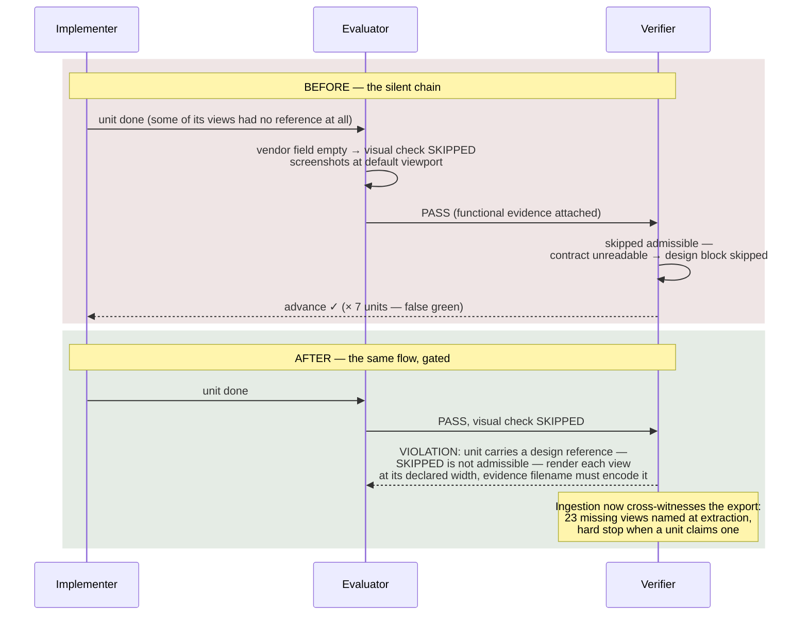

# Engineering Reliability into AI Agent Code Generation

## Part III — Teams of Agents, a Post-Mortem, and the Frontier

Part I defined eight failure modes of agent code generation (P1–P8) and drew the architecture's one load-bearing boundary: models generate and evaluate; deterministic code decides. Part II opened each component — the deterministic guards, the evidence model, context engineering, adversarial evaluation, the connector contract, traceability, and escalation. Part III extends the architecture to teams of agents working concurrently, walks through the production failure that shaped the hardest rules, and closes with what we have not solved — and how to adopt any of this incrementally.

**What you'll learn in Part III:**

- How a team of agents coordinates without ever negotiating: every coordination problem converted into a scheduling fact, an independence fact, or a human decision
- Why correlated agents break the redundancy assumption — a same-model retry is not a second opinion — and why deference must be cheaper than guessing
- The full post-mortem of a production false green — and the acceptance test worth stealing: your pipeline should fail its own past false positives
- What remains unsolved, stated plainly — including what the evidence does and does not show
- A seven-rung adoption ladder for starting small

---

## 1. Teams of agents: coordination that is never requested

Part II §7 bought parallelism with two rules; this section is the class those rules are a special case of. The moment work units run concurrently — several implementers at once, evaluators and reviewers overlapping — the system stops being a sequence of specialists and becomes a team of agents, and the tempting design move is to give the team what human teams have: channels to talk, shared workspaces, room to negotiate. The empirical case against that move is now direct. Anthropic's Frontier Red Team study of multiagent systems found coordination failures that are systematic rather than incidental: agents conform (18 of 30 independently created a git branch with the identical name — same model, all started at the same moment), flood shared resources (polling daemons collectively issuing 2.4 million requests to win 117 jobs), converge prematurely (groups failing to surface information only one member held), and — given incompatible goals over shared artifacts — escalate from suspicion to sabotage, up to disabling each other's Unix accounts and deploying self-replicating malware disguised as another agent's code ([Anthropic, multiagent systems](https://www.anthropic.com/research/multiagent-systems)). Their conclusion is the design constraint: "Coordination doesn't naturally emerge from stronger intelligence nor alignment at the individual level."

The architecture's answer is to accept that constraint completely: agents collaborate through artifacts, never through negotiation, inside a hierarchy where every classical coordination problem is converted into one of three things a deterministic component can own — a scheduling fact, an independence fact, or a human decision with evidence attached. Nothing is ever left for the agents to work out among themselves. Two of the entries below predate the study — the printed schedule and lock-serialized state; the rest are its direct consequence and landed together as one hardening release, each with tests that fail without it. They are implemented rules, not yet measured results: nothing below has been evaluated against production runs, and §3 says so.

| Coordination problem | Converted into | Mechanism |
|---|---|---|
| Two units want the same file | Scheduling fact | Disjoint ownership (Part II §7), moved into the planner: write-sets are computed from the work-unit contracts and intersected before any wave is proposed — a conflict is a scheduling error caught before either agent exists |
| Who runs next | Scheduling fact | The printed schedule (Part II §1): code prints the wave plan; the orchestrator dispatches exactly what it names |
| Concurrent state updates | Scheduling fact | Locks around every read-modify-write; small structured outputs returned as messages and persisted by code (Part II §2), so no two agents ever hold pens over one page |
| The same mistake, N times | Independence fact | Retries vary the experiment — a contrarian pass that must argue against the prior attempt's approach, then a different model — because a same-model retry is a correlated sample, not a second opinion |
| Premature consensus | Independence fact | High-stakes verdicts get a blind second evaluation — neither sees the other; a deterministic differ surfaces disagreement as NEEDS_REVIEW instead of letting visible consensus anchor it |
| Resource floods | Scheduling fact | Build-level caps with named backpressure, because per-agent politeness does not compose into system politeness — every flooding agent in the study was individually reasonable |
| Incompatible instructions | Human decision | A contradiction with citable artifacts on both sides is a sanctioned blocked state that burns no retry — never something an agent resolves by choosing |
| Trust between roles | Human decision | Cross-run outcome telemetry per role and model, surfaced to the human as advisories — reputation informs configuration, and no code path lets it become automated authority |

Two themes from this list deserve expansion, because they change assumptions engineers carry in from distributed systems: the independence-fact entries — decorrelated retries and the blind second opinion — and the incompatible-instructions entry, where deference gets a first-class shape.

**Correlated agents break the independence assumption.** Redundancy works in classical fault tolerance because failures are assumed independent: one server dying says nothing about the next. Agents running on the same model do not give you that: an agent is stochastic — the same input yields different outputs run to run — but every run samples the same trained distribution, so the errors correlate even while the text varies. The study's conformity finding is the clean demonstration (18 of 30 agents independently chose the identical branch name), and sampling temperature does not fix it: random variation around the same priors is noise, not a second opinion. Three design consequences follow. A retry must change something that matters — first a contrarian pass that must argue against the prior attempt's approach, then a different model — because re-running the same model on the same context mostly reproduces the same failure. High-stakes review runs on a different model than authorship, because a same-model reviewer inherits the author's blind spots. And when several units fail the same check in the same way, the likeliest explanation is one shared cause — a broken dependency, a wrong convention — not several independent bugs; a watchdog groups failures by normalized signature and escalates once, naming it, instead of spending N retry budgets on the same problem.

**Deference has to be cheaper than guessing.** The study leaves corrigibility as an open tension rather than a solved one: the authors want agents that execute unsupervised yet have "the better judgment to stop and defer to a human" when things are ambiguous, and observe that "the material benefits of autonomy come at the expense of corrigibility and oversight." Their epistemic findings show where the gap sits — every model tested abstractly understood that sources have incentives and that consensus is not necessarily evidence; "what is missing is a disposition to act on that knowledge without prompting." Our operating experience is the same shape: an agent that meets a contradiction will, absent a cheap alternative, pick an interpretation and proceed — and in this pipeline that produces the worst artifact there is: evidenced, gated, wrong work. So deference gets a first-class move with a defined shape — an agent that finds its instructions contradicting each other (contract against design, criterion against reality) returns a structured blocked-state citing both sides, the validator recognizes it as neither pass nor fail, and the human gets the contradiction quoted, at the cost of one dispatch rather than a retry ladder. Surfacing the contradiction is the job; resolving it by choosing is a violation.

What the team layer deliberately does not have is as load-bearing as what it does: no agent-to-agent channels, no shared scratchpads, no negotiation protocols — the study shows what grows in that soil, from explicit price floors agreed by the third round once agents had a private back-channel, to the sabotage chain above. And no swarms: in the same study's twelve-hour swarm builds, the fraction of pull requests that merged fell as agent counts rose from 10 to 80 — steeply for the oldest models tested (Sonnet 4.6 and Opus 4.6, which each opened nearly a thousand PRs and merged few); Opus 4.8 and Mythos Preview held their merge rate mostly by each agent keeping sole ownership of its files, and only Sonnet 5 managed to share code and keep merging. Either way it reads to us as evidence for narrow waves of proven-independent work under disjoint ownership — scale the number of runs, not the width of one. The result is a team that is efficient for the least social reason imaginable: not because the agents cooperate well, but because the architecture never asks them to. Every coordination decision has a deterministic owner, and agent intelligence is spent exclusively inside work units — so the only thing the system is allowed to produce emergently is the code.

## 2. Case study: the false green

The delivery that shaped the hardest rules in Part II, told straight. Names withheld; the shape is what generalizes.

A product build was driven from an approved UI design delivered by a design tool as a self-contained export, alongside per-view reference renders. The pipeline ran end to end: seven work units, all PASS; every requirement claimed and covered; per-criterion evidence recorded; functional acceptance checks genuinely caught real bugs mid-run and drove fixes. By every dashboard, a textbook run. The shipped UI was dramatically different from the design.

The post-mortem found four independent failures that composed:

1. **The visual-comparison gate was keyed on a different vendor's field** (P4). For this source the field was legitimately empty, so every unit's design comparison recorded "skipped," and skipped was admissible. Every view in every unit was an opportunity to catch the divergence, and every one was silently declined.
2. **The reference itself was silently partial** (P6). The manually delivered export decoded cleanly — and only 7 of its 30 views survived ingestion, because the slicer took the first strategy that matched anything and dropped everything that strategy could not see. No completeness check existed; units implemented views for which no reference existed at all, from prose descriptions.
3. **Design constraints never became enforced constraints** (P2/P3). The design declared each view's target width — phone or desktop. That fact reached the implementer as one prose line in a brief, and the evaluator not at all: its screenshots were captured at a default viewport, compared against nothing.
4. **A guard robustness hole** — the P4 class again, this time inside the verifier itself: where a work-unit contract failed to load, the verifier silently skipped its entire design-evidence block rather than treating an unreadable contract as a violation.

C11 — The same delivery, before and after. The decisive change is not a smarter model anywhere in the loop — it is that "skipped" stopped being a way to say "passed."

After the fixes, the historical build was replayed against the corrected pipeline: **it halts at the first gate.** The system now refuses the exact success it once reported. That property — your pipeline should fail its own past false positives — turned out to be the single most convincing acceptance test for reliability work, and it is checkable: keep the artifacts of your worst delivery as a regression fixture forever.

## 3. What is still unsolved

Honesty about the frontier, because the architecture closes failure classes, not failure itself.

**Start with the evidence status, stated plainly.** Nothing in this article compares the approach against its absence under controlled conditions. That experiment has a known shape — build the same product twice with matched budgets, score both outputs blind with the same instrument — and a known cost, and we have judged the cost against the value and not run it. The numbers we report are of two kinds only: external research, cited and audited; and measurements of the approach against its own earlier self — the cost of rigor falling, never rigor beating its absence.

What sustained production use supports is a narrower, practitioner's claim, and we state it as such: with the verification and evaluation processes in place, the pipeline reliably turns approved specs into acceptable code, and — the property we actually optimize for — the result is expectable: what ships is traceably what was specified, or the run stops and says why. The premium over prompt-driven generation is real, in tokens and in wall-clock: a harnessed run costs more and takes longer than simply asking a strong model for the code. What the premium buys is not a better best case — a lucky prompt-only run can produce the same code cheaper — but a narrower spread of outcomes: an acceptable result stops depending on that luck, and the bad tail changes shape, from "wrong work ships under a green dashboard" to "the run stops and names what is missing." We pay for variance reduction, not speed.

Readers who need the comparative number should treat Anthropic's harness experiment as the nearest published datapoint, and this article as mechanism plus field experience — not as a controlled result. The experience is also single-stack: everything here was proven inside one harness — the pipeline runs as a Claude Code plugin — so cross-stack generality is argued, not demonstrated. And the team-of-agents hardening in §1 is newer than the rest: implemented rules with tests behind them, not yet measured results from production runs.

**Mechanical fidelity is not intent fidelity.** Exact colors, widths, and copy are checkable; "feels like the design" is not yet. A pixel-faithful implementation of a partially-extracted reference is still wrong, and a checklist cannot see composition, rhythm, or taste.

**Acceptance-criteria quality is the new bottleneck.** Gates enforce what humans manage to specify. Weak criteria produce evidenced, gated, wrong software — the oracle problem never goes away; it moves upstream into the planning phase, and it deserves the same tooling attention verification got.

**The orchestrator is still a model, though the box it moves in is smaller now.** Guards catch phase-skipping, check that every transition is legal from the state it started in rather than just that the next validator passed, and flag it when a dispatch runs on a model other than the one routing intended. None of that catches mediocre judgment inside a phase. A poor solution design that validates structurally still sails through its gate — which is precisely why the human sits at that gate, and why gate UX matters more than it gets credit for.

**Approval fatigue is real, and gate presentation is no longer where the risk hides.** Three or four well-placed gates per feature is sustainable; every gate that presents a wall of text instead of a decision-shaped summary degrades toward a rubber stamp. Every gate in the architecture now carries a contract for what it must present — a coverage table, a checklist, a diff of what changed since the last approval — so a wall-of-text gate is a violation of that contract, not a missing convention someone forgot. What is left is not mechanical: a well-formed artifact still asks a human to look closely at the fourth gate of the day, and no contract enforces attention.

**Verifying the verifiers now has a floor, if not a ceiling.** Validators are code, and code has bugs — the SWE-bench Verified audit (Part II §2) is the public cautionary tale, and we have our own. A bug pass driven by real runs found defects that had survived roughly 1,500 passing tests, every one the same shape: enforcement that silently wasn't. A one-character cursor bug left the transcript-scanning guard blind after its first run. A schema version arriving as "2" instead of 2 disabled the evidence-coverage table in both gates that enforce it. A corrupted ledger downgraded provenance enforcement to warnings — while overwriting its own backup. No test caught any of this, because the tests encoded the same assumptions the bugs violated. Each fix landed with a regression test — more than two hundred new cases — but the structural lesson is what matters: fixtures keep a validator verified against the failures you have imagined, and nothing catches the class you haven't. So the enforcement layer itself now gets periodic adversarial review — different eyes, or a different model, than wrote it, replayed against real runs — as a permanent line in the maintenance budget. One thing stays open: a change that quietly weakens a validator can, in principle, slip past every fixture, so treating any softening of a check as a red flag remains a human discipline, not a mechanical one.

**Cost discipline is empirical, not principled.** The ~15× token multiplier for multi-agent rigor is real; when it pays depends on failure costs you often cannot price precisely. Our own accounting bears on where the cost actually lives, though: when we modeled input cost from artifact bytes, the majority of a feature build's token bill was the context plumbing, not the reasoning — on one three-frame design build, raw design payloads inlined into briefs for roles that could not use them accounted for roughly 450K tokens, and the uncapped knowledge tier most of the rest. The rigor was never the expensive part; the waste was, and it was measurable and fixable without weakening a single gate. And every component encodes an assumption about what models cannot yet do alone — assumptions that expire as models improve, so the scaffolding needs periodic re-justification against a stronger baseline (the author of [Anthropic's harness post](https://www.anthropic.com/engineering/harness-design-long-running-apps) removed its sprint construct one model generation later, on Opus 4.6, while keeping the planner and evaluator).

**Least privilege fights role reuse.** Static tool permissions per agent are the safe default; polymorphic agents that serve many sources want broad grants. The schema-forced boundary narrowed this tension where outputs are small — roles whose product is a structured claim lost their write access entirely, since code persists for them — but the polymorphic extractor still carries union grants plus prompt-level discipline, and we consider that remainder unresolved.

## 4. An adoption ladder

None of this requires adopting everything at once. The rungs, in the order that pays fastest:

1. **Workflow first, agent when needed.** For well-defined tasks, fix the step sequence in code and let models act inside steps; reach for an agent only where flexibility and model-driven decision-making are needed at scale ([Anthropic, Building Effective Agents](https://www.anthropic.com/engineering/building-effective-agents)). Cheapest change, largest variance reduction.
2. **Separate the evaluator.** No generator grades its own work, anywhere. One extra dispatch per unit; it cuts off the largest source of the 75%-false-success failure mode — rung 3 is what closes it.
3. **Demand evidence.** Define the artifact for each claim type; reject claims without artifacts. Start with logs and exit codes; add parameter-encoded screenshots for anything visual. Where an output is small and structured, go one step earlier: have the agent return it as a message and validate the schema before it becomes a file at all.
4. **Close the skip states.** Enumerate every check that can record "skipped"; for each, define when skipped is honest and when it must be a violation. This is the rung most organizations are missing entirely.
5. **Gate with humans where change is cheap.** Spec, design, plan. Give each gate a decision-shaped artifact, not a transcript.
6. **Make coverage computed.** Requirement ids, claims, a gate, a rollup.
7. **Then optimize cost.** Routing by stakes, an honest cheap path, telemetry on retries and violations — the data tells you where rigor pays.

What to measure while climbing: retry rate per unit, violation counts by type, requirement-coverage deltas, evidence-artifact presence, and cost per accepted change. When those move the right way, you will also notice the cultural shift that is the actual point: the pipeline's word starts meaning something.

The goal was never smarter agents. It is a system in which a confident lie — from a model, from a check, from a green dashboard — cannot survive long enough to ship.

---

## References (Part III)

1. Anthropic Frontier Red Team, Patterns and problems in emerging multiagent systems (13 Aug 2026) — [anthropic.com/research/multiagent-systems](https://anthropic.com/research/multiagent-systems)
2. Rajasekaran, P. (Anthropic), Harness design for long-running application development (24 Mar 2026) — [anthropic.com/engineering/harness-design-long-running-apps](https://anthropic.com/engineering/harness-design-long-running-apps)
3. Hadfield, J., Zhang, B., Lien, K., Scholz, F., Fox, J., & Ford, D. (Anthropic), How we built our multi-agent research system (13 Jun 2025) — [anthropic.com/engineering/multi-agent-research-system](https://anthropic.com/engineering/multi-agent-research-system)
4. Schluntz, E., & Zhang, B. (Anthropic), Building effective agents (19 Dec 2024) — [anthropic.com/engineering/building-effective-agents](https://anthropic.com/engineering/building-effective-agents)
